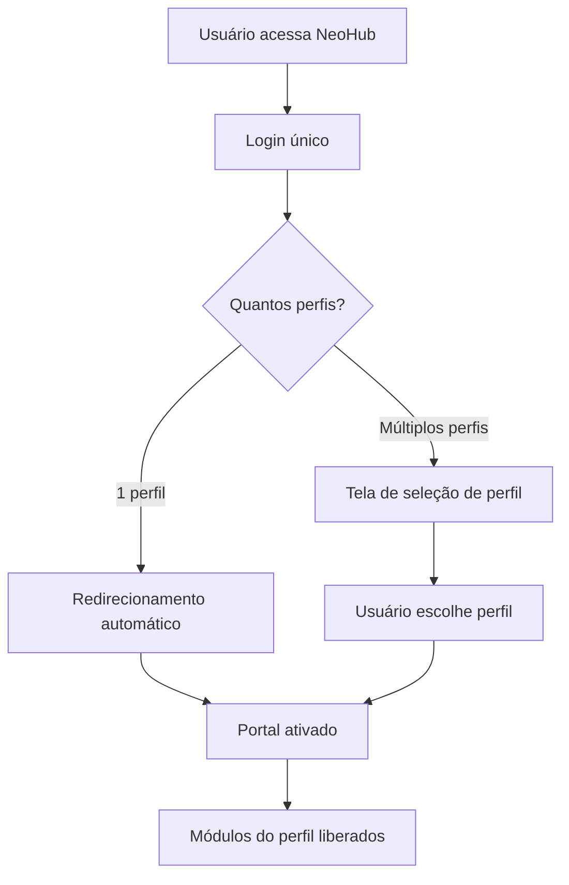

# 🏥 Neo Folic - Sistema Unificado de Gestão para Clínicas de Transplante Capilar

<p align="center">
  
</p>

## 📋 Visão Geral

Sistema completo e unificado de gestão para clínicas de transplante capilar. Atua como um **hub central** (NeoHub) com autenticação única e múltiplos portais ativados por perfil de usuário, fornecendo insights automáticos e ações corretivas baseados no desempenho dos indicadores.

**URL de Produção**: https://transplant-insight-hub.lovable.app

---

## 🏗️ Arquitetura do Sistema - NeoHub

O NeoHub é o **hub central unificado** que gerencia todos os portais do ecossistema Neo Folic. Cada usuário possui um único cadastro e pode ter múltiplos perfis simultaneamente.

### Portais Disponíveis

| Portal | Rota | Descrição |
|--------|------|-----------|
| **NeoCare** | `/neocare` | Portal do Paciente - agendamentos, prontuários, teleconsultas |
| **NeoTeam** | `/neoteam` | Portal do Colaborador - gestão de equipe e operações |
| **Academy** | `/academy` | Portal do Aluno - cursos, certificados, treinamentos |
| **NeoLicense** | `/neolicense` | Portal do Licenciado - dashboard, métricas, vendas |

### Fluxo de Acesso



---

## 👥 Perfis de Usuário

| Perfil | Portal | Descrição |
|--------|--------|-----------|
| **Paciente** | NeoCare | Acesso a agendamentos, prontuários, teleconsultas |
| **Colaborador** | NeoTeam | Gestão de equipe, recepção, financeiro, estoque |
| **Aluno** | Academy | Cursos, quizzes, certificados, progresso |
| **Licenciado** | NeoLicense | Dashboard completo, métricas, vendas, leads |

### Regras de Perfil
- Um usuário pode ter **múltiplos perfis** simultaneamente
- O perfil ativo define quais módulos são acessíveis
- Troca de perfil disponível a qualquer momento (para usuários com múltiplos perfis)
- Permissões são verificadas por rota via `ProfileGuard`

---

## 🚀 Funcionalidades por Portal

### 🏥 NeoCare (Portal do Paciente)

- **Dashboard Pessoal**: Próximas consultas, notificações
- **Agendamentos**: Visualização e criação de consultas
- **Prontuário**: Acesso ao histórico médico
- **Teleconsulta**: Consultas por vídeo
- **Documentos**: Termos e autorizações
- **Configurações**: Perfil, endereço, preferências

### 👔 NeoTeam (Portal do Colaborador)

- **Recepção**: Check-in, sala de espera, agendamentos
- **Médico**: Agenda, prontuários, prescrições
- **Financeiro**: Faturamento, pagamentos, fluxo de caixa
- **Estoque**: Inventário, movimentações, alertas
- **Admin**: Configurações, usuários, relatórios

### 🎓 Academy (Portal do Aluno)

- **Catálogo de Cursos**: Formação 360º, Trilhas Comercial e Médica
- **Módulos e Aulas**: Conteúdo em vídeo e texto
- **Quizzes**: Avaliações por lição
- **Certificados**: Geração automática em PDF
- **Progresso**: Tracking individual de conclusão

### 📊 NeoLicense (Portal do Licenciado)

- **Dashboard & Métricas**: Indicadores semanais do funil
- **HotLeads**: Funil de vendas com 5 etapas (Kanban/Lista)
- **Agenda de Cirurgias**: Calendário visual com checklists
- **Vendas**: Registro, KPIs, importação Excel
- **Gamificação**: Conquistas, pontos, ranking
- **Materiais**: Biblioteca digital de apoio
- **Jon Jobs**: Assistente IA integrado

---

## 🔥 HotLeads - Gestão de Leads

O módulo de HotLeads é compartilhado entre portais com diferentes níveis de acesso:

| Etapa | Descrição |
|-------|-----------|
| **Lead Novo** | Leads disponíveis para captura |
| **Lead Captado** | Leads resgatados pelo licenciado |
| **Consulta Agendada** | Consulta marcada com o lead |
| **Vendido** | Conversão realizada |
| **Descartado** | Lead não qualificado |

### Recursos
- Visualização Kanban/Lista alternável
- Prioridade por estado (1h de exclusividade)
- Dashboard analítico com métricas
- Comparativo de licenciados (admin)
- Filtros avançados por status, estado, procedimento

---

## 🔐 Segurança

### Autenticação Unificada
- Login único via NeoHub
- Sessões seguras com tokens JWT
- Gestão centralizada de perfis e permissões

### Proteção de Dados
- Row Level Security (RLS) em todas as tabelas
- Dados segmentados por perfil e permissão
- Auditoria de acessos

### API Security
- Edge Functions com CORS configurado
- Validação de payloads
- Rate limiting por endpoint

---

## 📡 API REST

Documentação completa disponível em `/api-docs`.

### Endpoints Principais

#### Leads
```bash
POST /functions/v1/receive-lead
Content-Type: application/json

{
  "name": "João Silva",
  "phone": "11999999999",
  "email": "joao@email.com",
  "state": "SP",
  "city": "São Paulo",
  "procedure_interest": "Transplante Capilar",
  "source": "Meta Ads"
}
```

#### Webhooks
```bash
POST /functions/v1/notify-hotlead-event
Content-Type: application/json

{
  "event_type": "lead_claimed",
  "lead_name": "João Silva",
  "licensee_name": "Dr. Pedro"
}
```

---

## 🛠️ Stack Tecnológica

### Frontend
| Tecnologia | Uso |
|------------|-----|
| React 18 | UI Library |
| TypeScript | Type Safety |
| Vite | Build Tool |
| Tailwind CSS | Styling |
| shadcn/ui | Component Library |
| Recharts | Charts & Graphs |
| React Router DOM | Routing |
| TanStack Query | Server State |
| React Hook Form + Zod | Forms & Validation |

### Backend (Lovable Cloud)
| Tecnologia | Uso |
|------------|-----|
| PostgreSQL | Database |
| Edge Functions | Serverless (Deno) |
| Realtime | WebSocket subscriptions |
| Storage | File uploads |
| Auth | Autenticação integrada |

### Mobile
| Tecnologia | Uso |
|------------|-----|
| Capacitor | Build Android/iOS |

---

## 📁 Estrutura de Pastas

```
src/
├── assets/                  # Imagens e arquivos estáticos
├── components/
│   ├── hotleads/            # Componentes do módulo HotLeads
│   ├── sales/               # Componentes de vendas
│   ├── surgery/             # Componentes de cirurgias
│   └── ui/                  # shadcn/ui components
├── contexts/                # React Contexts (Auth, Data)
├── hooks/                   # Custom hooks
├── integrations/            # Supabase client & types
├── pages/                   # Páginas do portal licenciado (legacy)
├── neohub/                  # 🆕 HUB CENTRAL UNIFICADO
│   ├── components/          # Componentes compartilhados
│   │   └── NeoCareSidebar.tsx
│   ├── contexts/            # NeoHubAuthContext
│   ├── pages/
│   │   ├── neocare/         # Portal do Paciente
│   │   │   ├── NeoCareHome.tsx
│   │   │   ├── NeoCareAppointments.tsx
│   │   │   ├── NeoCareNewAppointment.tsx
│   │   │   └── NeoCareSettings.tsx
│   │   ├── NeoHubLogin.tsx
│   │   ├── NeoHubRegister.tsx
│   │   └── ProfileSelector.tsx
│   └── NeoHubApp.tsx        # Roteamento principal do hub
├── portal/                  # Portal Médico (módulo legado)
│   ├── components/
│   ├── contexts/
│   └── pages/
├── marketplace/             # Marketplace Neo Folic
└── utils/                   # Funções utilitárias

supabase/
└── functions/               # Edge Functions
    ├── receive-lead/
    ├── notify-hotlead-event/
    ├── jon-jobs-chat/
    └── ...
```

---

## 🗄️ Schema do Banco de Dados

### NeoHub (Usuários Unificados)

| Tabela | Descrição |
|--------|-----------|
| `neohub_users` | Usuários do hub central |
| `neohub_user_profiles` | Perfis vinculados aos usuários |

### Portal do Licenciado

| Tabela | Descrição |
|--------|-----------|
| `profiles` | Perfis de licenciados |
| `leads` | Leads do funil de vendas |
| `sales` | Registro de vendas |
| `surgery_schedule` | Agenda de cirurgias |
| `achievements` | Conquistas disponíveis |
| `notifications` | Notificações do sistema |
| `materials` | Materiais de apoio |

### Academy

| Tabela | Descrição |
|--------|-----------|
| `courses` | Cursos da universidade |
| `course_modules` | Módulos dos cursos |
| `module_lessons` | Aulas dos módulos |
| `lesson_quizzes` | Quizzes por lição |
| `quiz_questions` | Perguntas dos quizzes |

### NeoCare / NeoTeam

| Tabela | Descrição |
|--------|-----------|
| `portal_users` | Usuários do portal médico |
| `portal_patients` | Pacientes |
| `portal_doctors` | Médicos |
| `portal_appointments` | Agendamentos |
| `portal_medical_records` | Prontuários |
| `portal_inventory_items` | Estoque |
| `portal_rooms` | Salas de atendimento |
| `portal_invoices` | Faturas |
| `portal_payments` | Pagamentos |

---

## 🚀 Como Executar

### Requisitos
- Node.js 18+
- npm ou bun

### Instalação

```bash
# Clone o repositório
git clone <URL_DO_REPOSITÓRIO>

# Instale as dependências
npm install

# Execute em desenvolvimento
npm run dev
```

### Acessando os Portais

| Portal | URL |
|--------|-----|
| NeoHub (Login) | `/login` ou `/register` |
| NeoCare | `/neocare` |
| NeoTeam | `/neoteam` |
| Academy | `/academy` |
| NeoLicense | `/neolicense` |

### Build para Produção

```bash
npm run build
```

### Mobile (Capacitor)

```bash
# Android
npx cap add android
npx cap sync
npx cap open android

# iOS
npx cap add ios
npx cap sync
npx cap open ios
```

---

## 📊 Métricas do Funil (NeoLicense)

O sistema monitora as seguintes etapas:

1. **Planejamento** - Metas definidas
2. **Tráfego** - Investimento em ads
3. **Landing Page** - Taxa de conversão
4. **Leads** - Volume captado
5. **Atendimento** - Tempo de resposta
6. **Agendamento** - Taxa de scheduling
7. **Consulta** - Comparecimento
8. **Vendas** - Conversão final
9. **Financeiro** - Faturamento
10. **Gestão** - Indicadores gerais

---

## 🤖 Assistente Virtual

**Jon Jobs** - Assistente IA integrado para suporte aos licenciados.
- Acesso via botão flutuante no NeoLicense
- Respostas contextualizadas
- Histórico de conversas
- NPS automático após encerramento

---

## 📈 Roadmap

- [x] Hub Central Unificado (NeoHub)
- [x] Login único com múltiplos perfis
- [x] Portal do Paciente (NeoCare)
- [x] Portal do Licenciado (NeoLicense)
- [ ] Portal do Colaborador (NeoTeam)
- [ ] Portal do Aluno (Academy)
- [ ] Integração WhatsApp Business API
- [ ] Dashboard de ROI por campanha
- [ ] Módulo de CRM avançado
- [ ] App mobile nativo

---

## 📄 Licença

Projeto proprietário - Neo Folic © 2024-2026

---

## 🤝 Suporte

Para suporte técnico, utilize:
- **Jon Jobs**: Assistente IA integrado (licenciados)
- **Chat de Suporte**: Disponível em todos os portais
- **Issues**: Abra uma issue neste repositório
